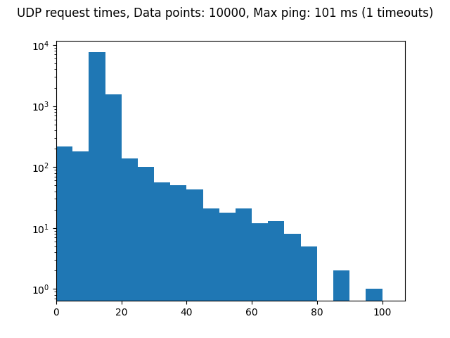
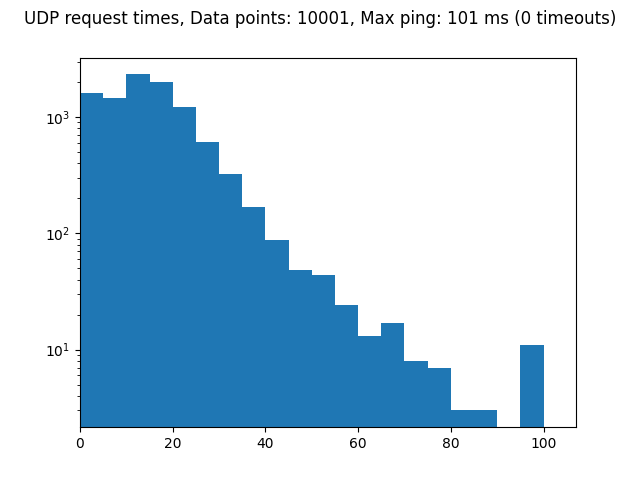

# Robot driver

Heavy duty 12 V servo motor driver with Wifi link

**⚠️ Status: prototype ⚠️**

https://user-images.githubusercontent.com/1014092/205401948-c3db500c-c33b-486b-9b15-0c6e07ba4ee2.mp4

## Features

- 3 bidirectional motor outputs (motors wired as H-bridge; 6 output channels in total)
- Wireless low-latency interface via UDP
- Battery powered with a 14.4 V Makita power tool battery
- Flexible I/O options for motor position encoders, servo motor drivers, etc.
- Hardware address pins allow multiple devices on a network
- Unity VR interface

## Tech

- ESP32 controller
- BTS7960 driver for each output channel
- Inrush current limiter via low-side series MOSFET

PCB fits the case of a Makita battery charger.

Bill of materials: [CSV](bom.csv)

## Benchmarking

### Motor driver

Supply rail transient response during the demo program (as in the video):

### Network

Each controller announces its presence by sending a UDP broadcast message containing its hardware address and IP address.

Packets containing control commands can then sent to a specific IP address, based on selecting a hardware address.

#### UDP network benchmarks for uncongested wifi

#### UDP network benchmarks for congested wifi

## License

[Open source hardware](https://www.oshwa.org/) is hardware for which the design is made publicly available, so that anyone can study, modify, distribute, make, and sell the design or hardware based on that design, subject to the following license conditions.

Hardware licensed under the *CERN Open Hardware Licence Version 2 - Weakly Reciprocal,* a copy of which is included in this repository at [cern_ohl_w_v2.txt](https://github.com/turingbirds/robot-driver/blob/master/cern_ohl_w_v2.txt).

Software licensed under the *Apache License 2.0,* a copy of which is included at [apache_license_2.0.txt](https://github.com/turingbirds/robot-driver/blob/master/apache_license_2.0.txt).

## Credits

This project was co-produced by V2_ Lab for the Unstable Media as part of the Winter Sessions art and technology residencies. ♥️
